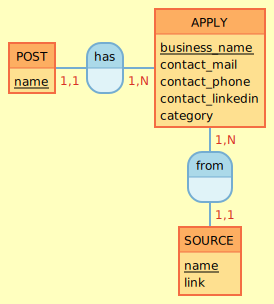

# Apply-FollowUp

Projet en duo avec [@Aeilxs](https://github.com/Aeilxs) permettant de suivre ses candidatures lors d'une recherche d'emploi. En effet, nous sommes en recherche d'une alternance de concepteur développeur d'application (CDA) suite à notre formation de développeur web et web mobile faite chez [O'Clock](https://oclock.io/) !

## But du projet

Faciliter le suivi de ses candidatures lors d'une recherche d'emploi à l'aide d'un tableau de bord.

## Technologies utilisées

- Front-end: React 18.2.0
- Back-end: API REST (PHP 7 - PHP SYMFONY 5.4)

### MCD (peut changer)

### MLD

TODO